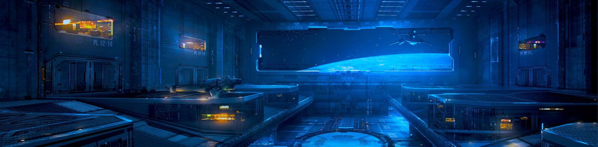

 

<!-- <b style="font-size: 20px; margin-right: 10px">Social:</b> -->
<a href="https://twitter.com/cliffordfajard0">
    cliffordfajard0
</a>

 

## Hello World
I love creating for the web! In this area, I'm passionate about:
- Working on Web infrastructure, developer tooling and reverse engineering technologies I use to learn and for fun
- Creating web experiences that are fast, accessible & delight to use.

## Social 👋 
- Best way to connect or talk with me about anything almost is on twitter ([@cliffordfajard0](https://twitter.com/cliffordfajard0))
- Outdoor adventures IG: [@cliffordfajardo](https://www.instagram.com/cliffordfajardo/)
